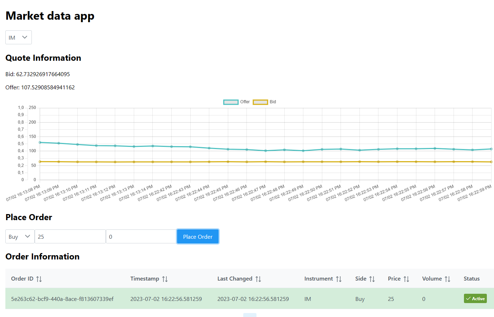

# Торговое Приложение

Данный проект представляет собой простое React-приложение для торговли на бирже.

## Установка

Для установки этого приложения вам потребуется установить [Node.js](https://nodejs.org/ru/) и [npm](https://www.npmjs.com/) После их установки перейдите в директорию проекта и выполните следующую команду:

npm install - 
эта команда установит все необходимые пакеты, перечисленные в файле package.json.

## Использование

Чтобы запустить приложение, используйте следующую команду:

npm start
Приложение запустится на localhost и будет доступно на порту 3000. Откройте веб-браузер и перейдите по адресу http://localhost:3000, чтобы просмотреть приложение.

